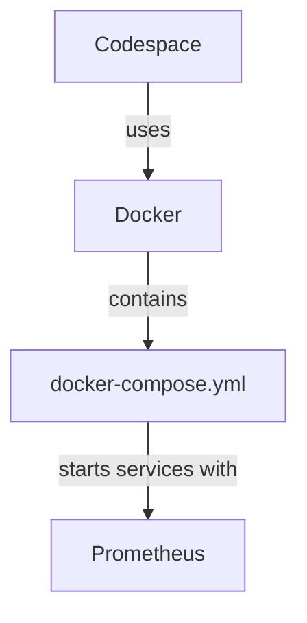

To write on top of arrows in a Mermaid diagram, you can use the `--> |text|` syntax, where `text` is the label that you want to display above the arrow. Here's an example of how to write labels on the arrows between nodes:

This will display "uses" above the arrow from `Codespace` to `Docker`, "contains" above the arrow from `Docker` to `docker-compose.yml`, and "starts services with" between `docker-compose.yml` and `Prometheus`. You can customize these labels based on the relationships you want to highlight in your diagram.