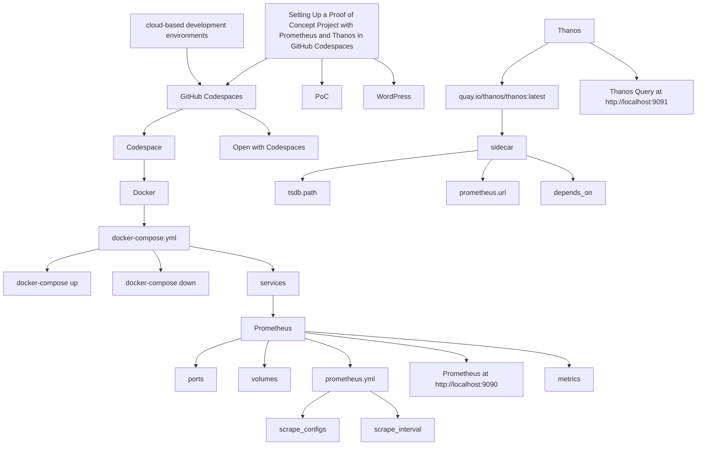

Here's the Mermaid diagram based on the relationships described:

This Mermaid diagram captures the relationships between the components, showing how different parts of the project connect to each other in setting up a proof of concept project with Prometheus and Thanos.

Here are the relationships between the components in the Mermaid diagram and explanations of why they're connected:

1. **Setting Up a Proof of Concept Project with Prometheus and Thanos in GitHub Codespaces** → **GitHub Codespaces**
   - **Why**: The project is being set up within GitHub Codespaces, which provides a cloud-based environment for development.

2. **GitHub Codespaces** → **Codespace**
   - **Why**: A *Codespace* is the specific development environment created in GitHub Codespaces where you will work on the project.

3. **GitHub Codespaces** → **Open with Codespaces**
   - **Why**: You need to open your repository with *Codespaces* to access and work within the cloud-based environment.

4. **Codespace** → **Docker**
   - **Why**: *Docker* is a tool used within the Codespace to manage containerized applications like Prometheus and Thanos.

5. **Docker** → **docker-compose.yml**
   - **Why**: The *docker-compose.yml* file is essential for defining and configuring the services (Prometheus and Thanos) that will run in Docker containers.

6. **docker-compose.yml** → **docker-compose up**
   - **Why**: *docker-compose up* is the command used to launch the services defined in the *docker-compose.yml* file.

7. **docker-compose.yml** → **docker-compose down**
   - **Why**: *docker-compose down* is the command to stop and clean up the services.

8. **docker-compose.yml** → **services**
   - **Why**: The *services* section within *docker-compose.yml* specifies what applications (Prometheus, Thanos) will be run in containers.

9. **services** → **Prometheus**
   - **Why**: *Prometheus* is one of the key services being set up for monitoring.

10. **services** → **Thanos**
    - **Why**: *Thanos* is another service that complements Prometheus by providing long-term storage and querying capabilities.

11. **Prometheus** → **ports**
    - **Why**: The *ports* configuration exposes Prometheus' service to the outside world so it can be accessed, e.g., at *http://localhost:9090*.

12. **Prometheus** → **volumes**
    - **Why**: *volumes* are used to persist Prometheus' data across container restarts.

13. **Prometheus** → **prometheus.yml**
    - **Why**: The *prometheus.yml* file configures how Prometheus scrapes and gathers metrics data.

14. **prometheus.yml** → **scrape_configs**
    - **Why**: The *scrape_configs* section defines which targets Prometheus should scrape for metrics.

15. **prometheus.yml** → **scrape_interval**
    - **Why**: The *scrape_interval* defines how frequently Prometheus will scrape data from the configured targets.

16. **Thanos** → **quay.io/thanos/thanos:latest**
    - **Why**: *quay.io/thanos/thanos:latest* refers to the latest version of the Thanos Docker image used to run the Thanos service.

17. **quay.io/thanos/thanos:latest** → **sidecar**
    - **Why**: The *sidecar* is a component of Thanos that runs alongside Prometheus and helps integrate with it.

18. **sidecar** → **tsdb.path**
    - **Why**: *tsdb.path* is the directory path where Prometheus stores its data, which Thanos needs to access for long-term storage.

19. **sidecar** → **prometheus.url**
    - **Why**: *prometheus.url* specifies the URL where the Thanos sidecar connects to Prometheus to retrieve metrics.

20. **sidecar** → **depends_on**
    - **Why**: *depends_on* defines the dependency between Thanos and Prometheus, meaning Thanos cannot start until Prometheus is up and running.

21. **Prometheus** → **Prometheus at http://localhost:9090**
    - **Why**: Prometheus exposes a web interface at *http://localhost:9090*, where you can interact with it and check its metrics.

22. **Thanos** → **Thanos Query at http://localhost:9091**
    - **Why**: Thanos Query provides a web interface at *http://localhost:9091* where you can query data from Prometheus and other data sources.

23. **Prometheus** → **metrics**
    - **Why**: Prometheus collects and stores *metrics* data, which can be queried and analyzed using both Prometheus and Thanos.

24. **cloud-based development environments** → **GitHub Codespaces**
    - **Why**: GitHub Codespaces is a *cloud-based development environment* where this entire setup can be built and tested remotely.

25. **Setting Up a Proof of Concept Project with Prometheus and Thanos in GitHub Codespaces** → **WordPress**
    - **Why**: The entire tutorial or project setup could be shared or documented on a *WordPress* blog, making it accessible to others.